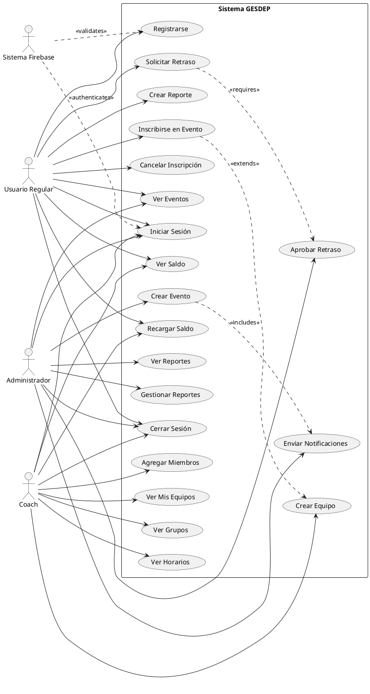
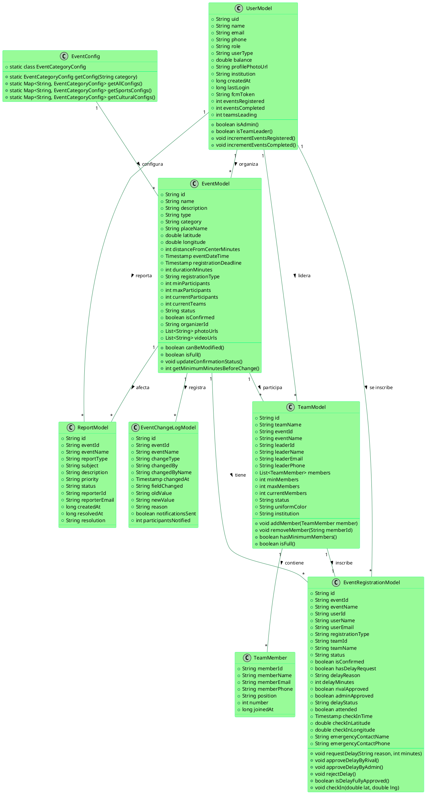
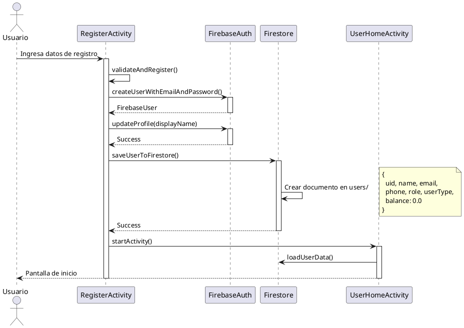
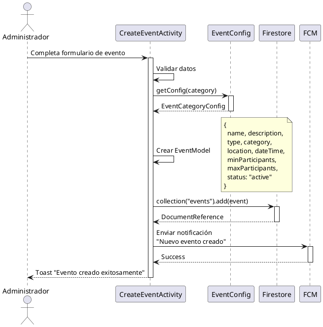
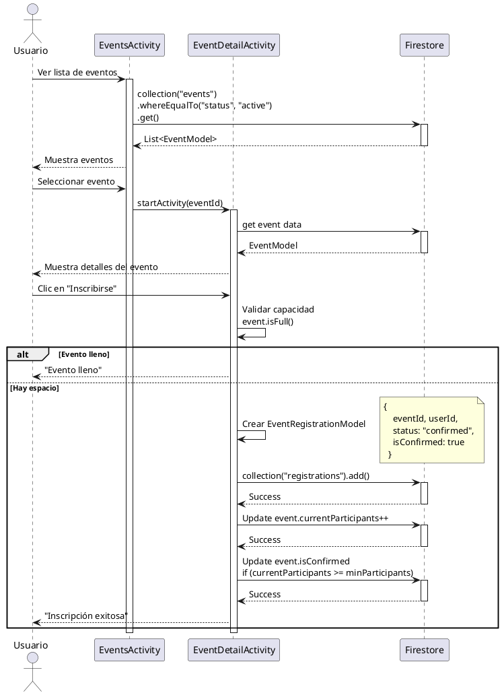
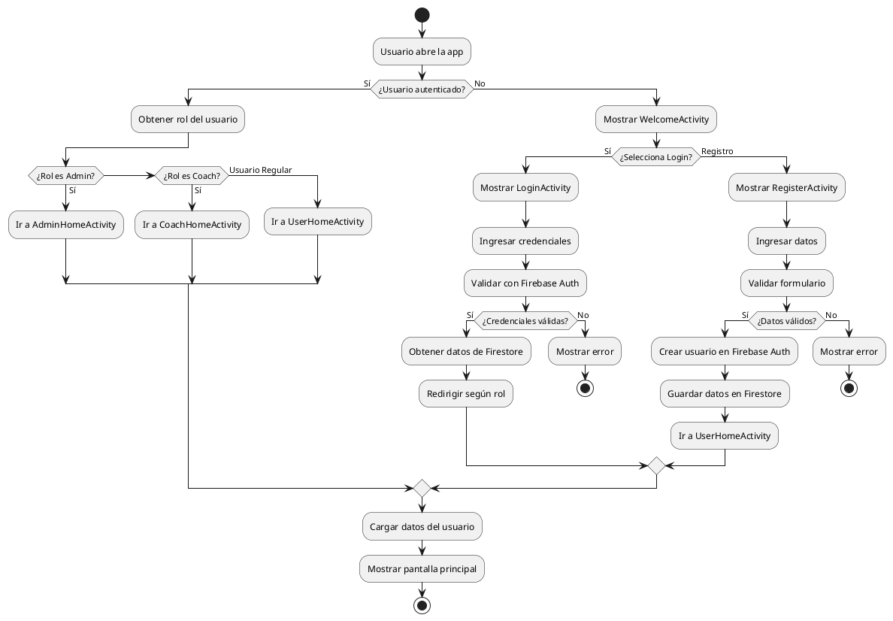
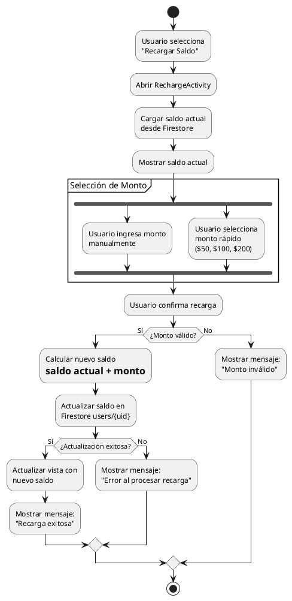
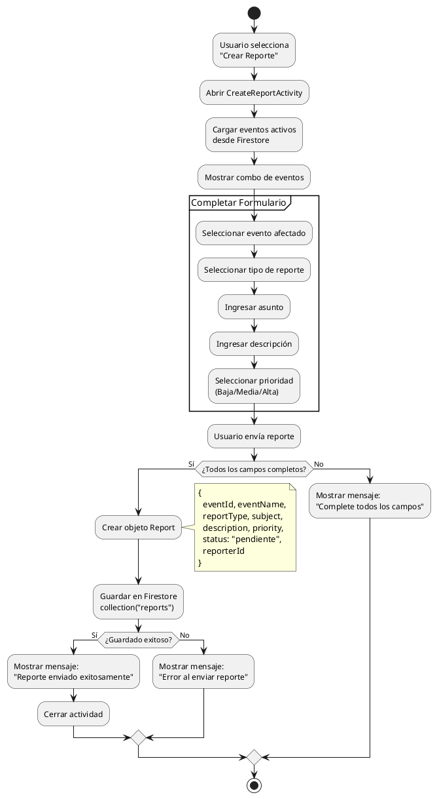
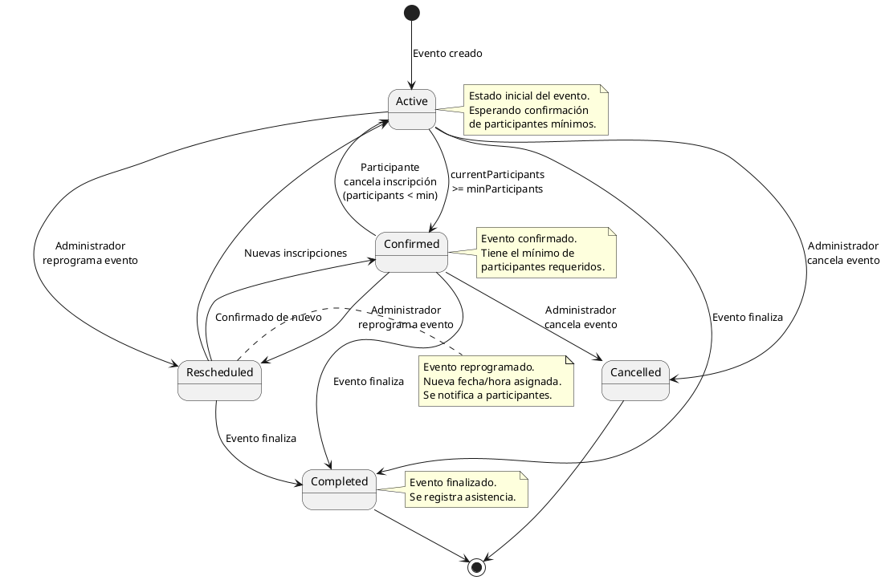

# 📐 DIAGRAMAS UML - SISTEMA GESDEP

## Sistema de Gestión de Eventos Deportivos y Culturales

---

## 📋 ÍNDICE

1. [Diagrama de Casos de Uso](#diagrama-de-casos-de-uso)
2. [Diagrama de Clases](#diagrama-de-clases)
3. [Diagrama de Secuencia - Registro de Usuario](#diagrama-de-secuencia---registro-de-usuario)
4. [Diagrama de Secuencia - Crear Evento](#diagrama-de-secuencia---crear-evento)
5. [Diagrama de Secuencia - Inscripción a Evento](#diagrama-de-secuencia---inscripción-a-evento)
6. [Diagrama de Actividades - Flujo de Autenticación](#diagrama-de-actividades---flujo-de-autenticación)
7. [Diagrama de Actividades - Recarga de Saldo](#diagrama-de-actividades---recarga-de-saldo)
8. [Diagrama de Actividades - Crear Reporte](#diagrama-de-actividades---crear-reporte)
9. [Diagrama de Estados - Evento](#diagrama-de-estados---evento)
10. [Diagrama de Componentes](#diagrama-de-componentes)

---

## 1. DIAGRAMA DE CASOS DE USO

---

## 2. DIAGRAMA DE CLASES

---

## 3. DIAGRAMA DE SECUENCIA - REGISTRO DE USUARIO

---

## 4. DIAGRAMA DE SECUENCIA - CREAR EVENTO

---

## 5. DIAGRAMA DE SECUENCIA - INSCRIPCIÓN A EVENTO

---

## 6. DIAGRAMA DE ACTIVIDADES - FLUJO DE AUTENTICACIÓN

---

## 7. DIAGRAMA DE ACTIVIDADES - RECARGA DE SALDO

---

## 8. DIAGRAMA DE ACTIVIDADES - CREAR REPORTE

---

## 9. DIAGRAMA DE ESTADOS - EVENTO

---

## 10. DIAGRAMA DE COMPONENTES

```plantuml
@startuml
package "Presentation Layer" {
  [WelcomeActivity]
  [LoginActivity]
  [RegisterActivity]
  [AdminHomeActivity]
  [CoachHomeActivity]
  [UserHomeActivity]
  [EventsActivity]
  [CreateEventActivity]
  [RechargeActivity]
  [CreateReportActivity]
}

package "Business Logic" {
  [EventConfig]
  [Validators]
  [Utils]
}

package "Data Layer" {
  [Models] as models
  [Adapters] as adapters
}

package "Firebase Services" {
  [Firebase Auth]
  [Cloud Firestore]
  [Firebase Storage]
  [Firebase Messaging]
}

package "External Services" {
  [Google Maps API]
  [Payment Gateway]
}

' Relaciones Presentation -> Business Logic
[WelcomeActivity] --> [Firebase Auth]
[LoginActivity] --> [Firebase Auth]
[RegisterActivity] --> [Firebase Auth]
[RegisterActivity] --> [Cloud Firestore]

[AdminHomeActivity] --> [Cloud Firestore]
[CoachHomeActivity] --> [Cloud Firestore]
[UserHomeActivity] --> [Cloud Firestore]

[EventsActivity] --> [Cloud Firestore]
[EventsActivity] --> [adapters]
[CreateEventActivity] --> [EventConfig]
[CreateEventActivity] --> [Cloud Firestore]
[CreateEventActivity] --> [Firebase Messaging]

[RechargeActivity] --> [Cloud Firestore]
[RechargeActivity] --> [Payment Gateway]

[CreateReportActivity] --> [Cloud Firestore]

' Business Logic -> Data
[EventConfig] ..> [models]
[Validators] ..> [models]

' Adapters -> Models
[adapters] ..> [models]

' Models -> Firebase
[models] ..> [Cloud Firestore]

' Google Maps
[EventsActivity] ..> [Google Maps API]
[CreateEventActivity] ..> [Google Maps API]

note right of [Firebase Auth]
  Autenticación de usuarios
  con email/contraseña
end note

note right of [Cloud Firestore]
  Base de datos NoSQL
  en tiempo real
end note

note right of [EventConfig]
  Configuraciones de
  categorías de eventos
end note

@enduml
```

---

## 📊 DESCRIPCIÓN DE DIAGRAMAS

### 1. Diagrama de Casos de Uso
Muestra las interacciones principales entre los actores (Usuario Regular, Administrador, Coach) y el sistema GESDEP. Incluye casos de uso para:
- Autenticación (registro, login, logout)
- Gestión de eventos (crear, ver, inscribirse)
- Gestión de equipos (crear, agregar miembros)
- Gestión de saldo (recargar, consultar)
- Reportes (crear, gestionar)

### 2. Diagrama de Clases
Representa la estructura de clases del modelo de datos del sistema:
- **UserModel**: Gestión de usuarios
- **EventModel**: Gestión de eventos
- **TeamModel**: Gestión de equipos
- **EventRegistrationModel**: Inscripciones a eventos
- **EventChangeLogModel**: Auditoría de cambios
- **ReportModel**: Sistema de reportes
- **EventConfig**: Configuraciones de eventos

### 3-5. Diagramas de Secuencia
Muestran la interacción temporal entre objetos para:
- Registro de nuevos usuarios
- Creación de eventos por administradores
- Proceso de inscripción a eventos

### 6-8. Diagramas de Actividades
Representan el flujo de procesos:
- Autenticación y redirección por roles
- Proceso de recarga de saldo
- Creación de reportes

### 9. Diagrama de Estados
Muestra los diferentes estados por los que puede pasar un evento:
- Active → Confirmed → Completed
- Transiciones a Cancelled o Rescheduled

### 10. Diagrama de Componentes
Arquitectura del sistema organizada en capas:
- **Presentation Layer**: Activities y UI
- **Business Logic**: Lógica de negocio y validaciones
- **Data Layer**: Modelos y adaptadores
- **Firebase Services**: Servicios de backend
- **External Services**: APIs externas

---

## 🎯 PATRONES DE DISEÑO IDENTIFICADOS

1. **MVC (Model-View-Controller)**
   - Models: EventModel, UserModel, etc.
   - Views: XML Layouts
   - Controllers: Activities

2. **Singleton**
   - Firebase instances (Auth, Firestore)

3. **Adapter Pattern**
   - EventsAdapter, TeamsAdapter
   - Para RecyclerViews

4. **Observer Pattern**
   - Firebase Realtime Listeners
   - LiveData para cambios en tiempo real

5. **Strategy Pattern**
   - EventConfig para diferentes configuraciones de eventos

---

**Generado:** 6 de Diciembre, 2025
**Herramienta:** PlantUML
**Desarrollado con Claude Code** 🤖
